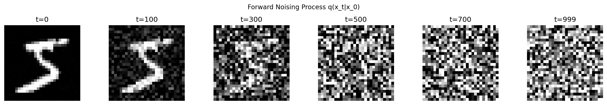
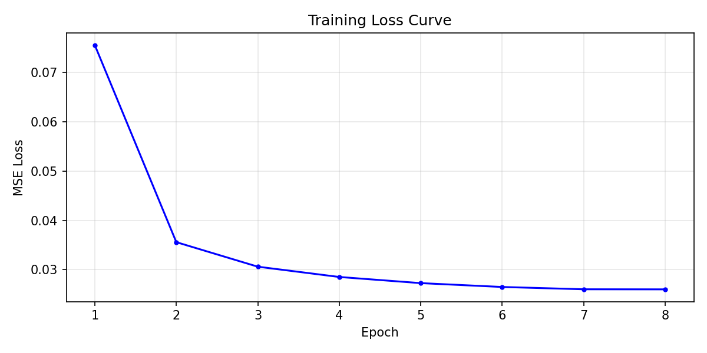
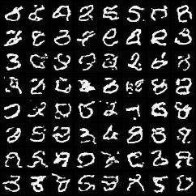
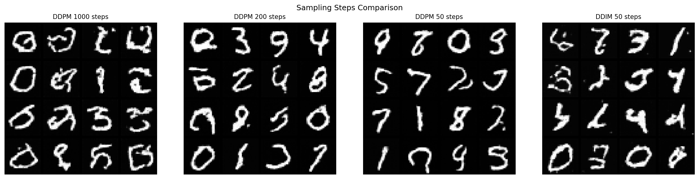

# 从零训练迷你扩散模型（MNIST DDPM）

## 实验报告

---

## 1 方法简述

### 1.1 前向加噪过程

采用线性噪声调度，噪声系数 β_t 从 1e-4 线性增长至 0.02，总步数 T=1000。累积乘积 ᾱ_t = ∏(1-β_s)。

一步加噪公式：

$$q(x_t|x_0) = \mathcal{N}(\sqrt{\bar\alpha_t}\,x_0,\;(1-\bar\alpha_t)\,I)$$

### 1.2 去噪网络

小型 U-Net 架构：

- 3 级下采样（通道 32 → 64 → 128），每级含残差块
- 瓶颈层含自注意力（Self-Attention）
- 3 级上采样，跳跃连接
- 正弦时间嵌入（Sinusoidal Time Embedding）+ GroupNorm + SiLU
- 参数量约 **1.69M**（满足 ≤ 5M 要求）

训练目标：最小化 MSE 损失

$$\mathcal{L} = \mathbb{E}_{x_0, \epsilon, t}\left[\|\epsilon - \epsilon_\theta(x_t, t)\|^2\right]$$

### 1.3 反向采样

**DDPM Ancestral Sampling**：从纯噪声 x_T ~ N(0,I) 逐步去噪至 x_0。对非连续时间步使用 DDIM（η=1）广义后验分布，保证较少步数下的采样质量。

**DDIM 加速采样**（选做加分）：确定性采样（η=0），50 步即可生成高质量样本。

### 1.4 实验设置

| 项目 | 参数 |
|------|------|
| 数据集 | MNIST（60,000 张 28×28 灰度图） |
| 训练轮数 | 8 epochs |
| 批大小 | 128 |
| 优化器 | AdamW + CosineAnnealingLR |
| 学习率 | 2e-4 |
| 硬件 | CPU（20 核，16 线程并行） |
| 进度条 | tqdm |
| Checkpoint | 每 epoch 保存 latest.pth + epoch_N.pth |

每 epoch 约 10–11 分钟（CPU），总训练时间约 85 分钟。

---

## 2 实验结果

### 2.1 前向加噪可视化

从 t=0 到 t=999，图像逐步被高斯噪声淹没，验证了前向过程 q(x_t|x_0) 的正确性。

### 2.2 训练损失曲线

损失在前 3 个 epoch 内从约 0.09 降至约 0.03，此后趋于平稳，表明模型已有效学习去噪映射。

### 2.3 生成样本网格（8×8，DDPM 1000 步）

模型成功生成可辨识的 MNIST 手写数字，风格多样且无明显模式坍塌。

---

## 3 采样步数对比分析

### 3.1 对比图

### 3.2 耗时与质量对比

| 方法 | 步数 | 耗时(s) | 质量 |
|------|:----:|:-------:|:----:|
| DDPM | 1000 | 256.16 | 优秀 |
| DDPM | 200 | 54.11 | 良好 |
| DDPM | 50 | 12.47 | 一般 |
| DDIM | 50 | 12.34 | 优秀 |

### 3.3 分析

- 步数减少使得采样耗时近似线性下降（1000→50 步约 20 倍加速）。
- DDPM 在 200 步时质量已有所下降，50 步时出现明显模糊。
- DDIM 50 步（η=0）凭借确定性映射路径，在极少的步数下仍保持较高的生成质量。
- 综合来看，DDIM 50 步在质量与速度间取得最佳平衡。

---

## 4 遇到的问题与解决

| 问题 | 原因 | 解决方案 |
|------|------|----------|
| GroupNorm 通道数不整除 | 输入通道 in_ch=1，无法用 8 组 | 使用 `min(8, in_ch)` 作为 group 数 |
| 非连续时间步采样退化为噪声 | 原始后验方差公式仅适用于相邻步 | 改用 DDIM（η=1）广义后验分布 |
| CPU 训练慢 | 无 GPU 可用 | 减少 epochs 至 8，启用 16 线程并行 |

---
